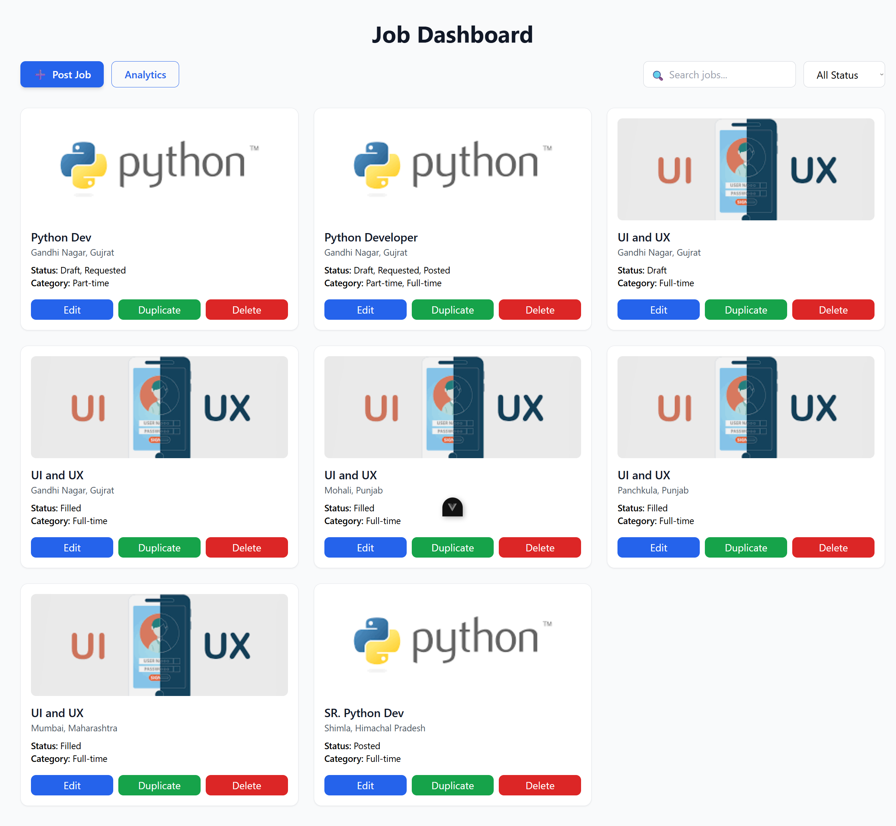
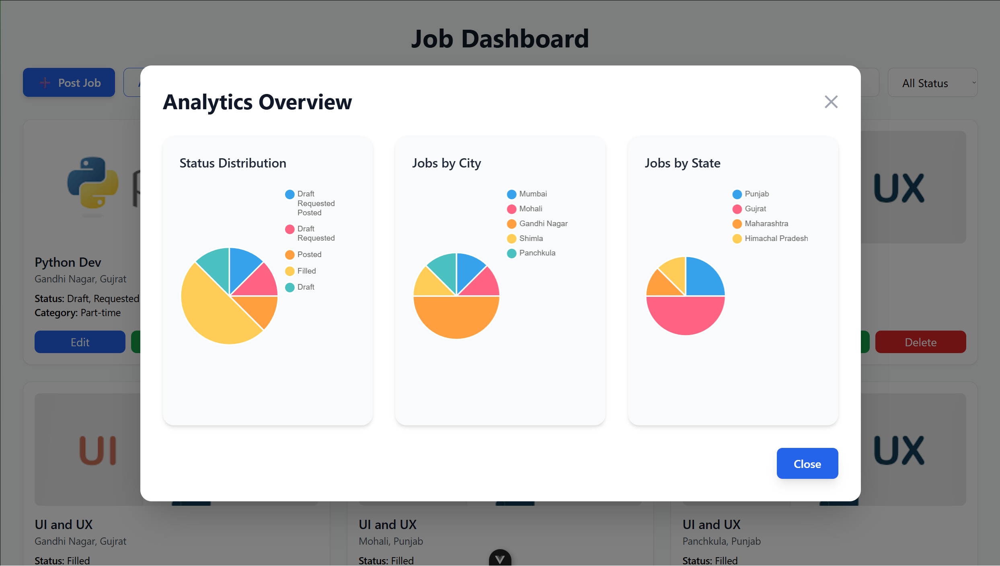
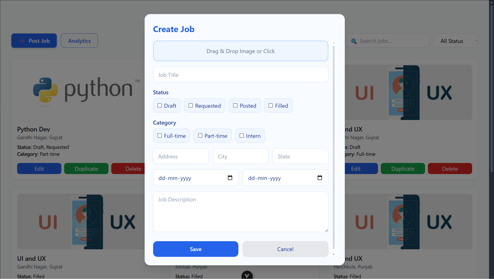
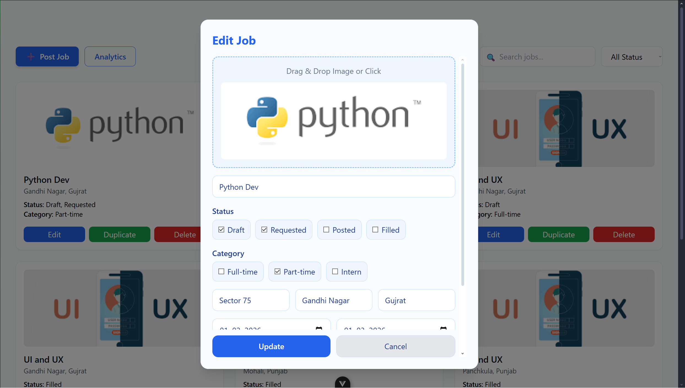
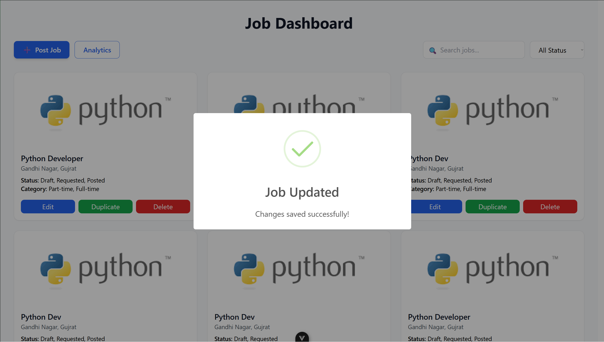
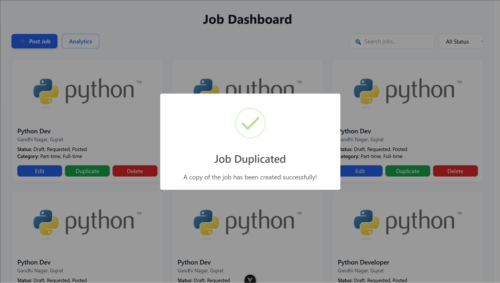
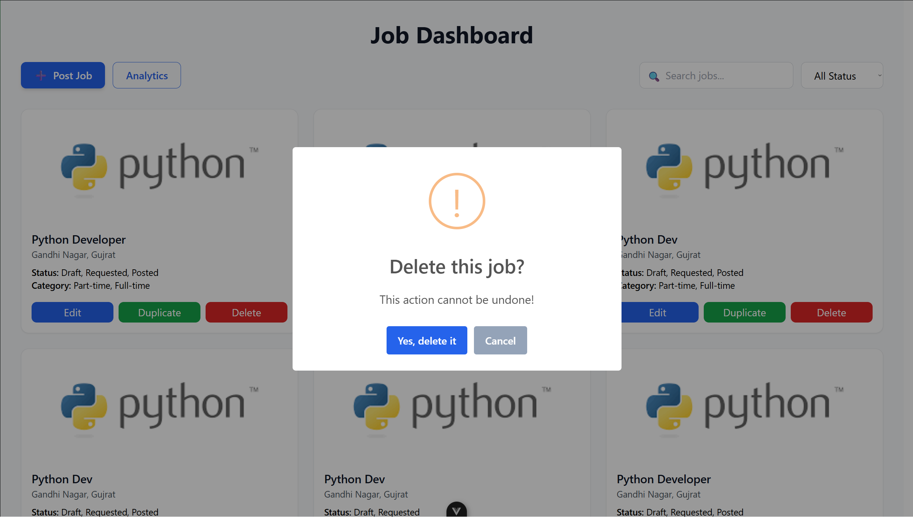

# 🚀 Job Management Dashboard

A full-stack **Job Management System** built with **Django (Backend)** and **Vue.js + Tailwind (Frontend)**.  
Includes job creation, editing, duplication, deletion, analytics, image uploads, and a modern UI with alerts.

---

## 🧱 Tech Stack

### Backend
- Django  
- Django REST Framework  
- PostgreSQL / SQLite  
- python-dotenv  

### Frontend
- Vue 3  
- Tailwind CSS  
- SweetAlert2 (CDN)  
- Chart.js  

---

## ✨ Features

- Create, Update, Delete Jobs  
- Duplicate Jobs  
- Upload Job Images  
- Multi-select Status & Category  
- Search & Filter Jobs  
- Analytics Dashboard (Pie Charts)  
- Modern Alert System (SweetAlert)  
- Secure `.env` Database Setup  

---
# Preview
## Dashboard


## Analytics


## Post Job


## Update Job


## Updated Successfully


## Duplicate Job


## Delete Job


## Deleted Successfully


---

## 🔐 Environment Variables (.env)

Create a `.env` file inside the **backend** folder:

```env
DB_NAME=jobsdb
DB_USER=postgres
DB_PASSWORD=123
DB_HOST=localhost
DB_PORT=5432
```

## ⚙️ Backend Setup
1️⃣ Create Virtual Environment
```
python -m venv venv
source venv/bin/activate   # Windows: venv\Scripts\activate
```

2️⃣ Install Dependencies
```
pip install -r requirements.txt
pip install python-dotenv
```
3️⃣ Configure Database (settings.py)
```from dotenv import load_dotenv
import os

load_dotenv()

DATABASES = {
    'default': {
        'ENGINE': 'django.db.backends.postgresql',
        'NAME': os.getenv("DB_NAME"),
        'USER': os.getenv("DB_USER"),
        'PASSWORD': os.getenv("DB_PASSWORD"),
        'HOST': os.getenv("DB_HOST"),
        'PORT': os.getenv("DB_PORT"),
    }
}
```
4️⃣ Run Migrations
```
python manage.py makemigrations
python manage.py migrate
```

5️⃣ Start Server
```
python manage.py runserver
```

Backend runs on:

```
http://127.0.0.1:8000/
```
🎨 Frontend Setup (Vue + Tailwind)
1️⃣ Install Dependencies
```
npm install
```
2️⃣ Run Frontend
```
npm run dev
```

Frontend runs on:
```
http://localhost:5173/
```
